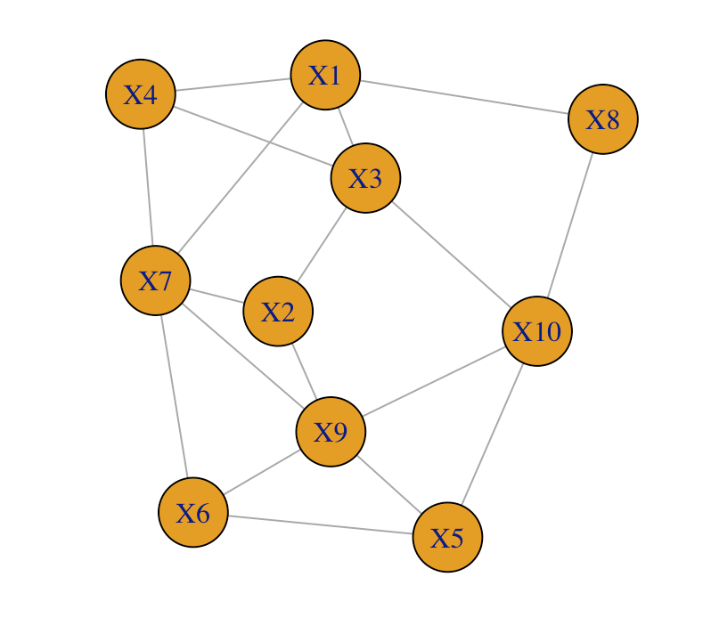

## Content{#content}

1. [Introduction](#introduction)
2. [Review of GLM](#GLM_review)
3. [Basic functionalities](#basic_function)
4. [Experiments / Examples](#experiments)
5. [Theory](#theory)
6. [References](#references)

## 1. Introduction {#introduction}
The goal of the "glmGraph" package is to learn an approximate multivariate distribution from data. Suppose the target multivariate distribution has a density $f(x_1, x_2, ..., x_p)$, to model this density, we first factorise it into $p$ components,
$$f(x_1, x_2, ..., x_p) = f_1(x_1 | x_2, ..., x_n)\,f_2(x_2 | x_3, ..., x_p) \cdots f_{p-1}(x_{p-1} |x_p) \, f_p(x_p),$$
then we specify a graph to describe the conditional dependencies, $x_i | x_j, j \in \mathcal{I}$ for some index set $\mathcal{I}$, and $p$ parametric models to describe the (conditional / marginal) distributions $f_1, f_2, ..., f_p$.


For sake of clarity, we briefly introduce the graphical model. A graphical model is a statistical model specified by a graph. A graph consists of nodes and edges: nodes represent variables, and an edge between two nodes represents dependence between two variables. An example of a graph is shown in Figure 1. The graph specifies the dependence between the variables and gives us a way to simplify the conditional distributions. Take variable $X_1$ as an example; since this node is connected to only $X_3, X_4, X_7, X_8$, we have $f_1(x_1 | x_2, x_3, ..., x_{10}) = f_1(x_1 | x_3, x_4, x_7, x_8)$. Repeating the same procedure for all $10$ components gives us a simplified factorisation. 


Next, we specify distributions for the simplified factorisation. The model we use is the Generalised Linear Model (GLM), the relationship between the variables is modelled by     
    $$E(X_1 | X_2, ..., X_p) = g^{-1}\left(\sum_{j=2}^p X_j \beta_j\right),$$ 
where $\beta_j, j = 2, 3, ..., p$ are the parameters in the model, and $g^{-1}$ is the inverse-link function capturing the relationship between the conditional mean and the covariates. For a more detailed description of the GLM model, see section [2](#GLM_review). 


```{r, eval = F, echo = F}
# codes to produce the example graph
rm(list = ls())
library(glmGratph)
num_nodes <- 10
rgraph <- create_random_graph(num_nodes, p = 0.2)
plot_graph(rgraph, vertex.size = 30, vertex.label = paste("X", 1:10, sep = ""))
```
```{r, echo = F, out.width = "400px", fig.cap='Figure 1. An example of a graph.'}

```


## 2. Review of Generalised Linear Model (GLM) {#GLM_review}


## 3. Basic functionalities {#basic_function}
In this section, we go through some examples to illustrate the usage of the key functions in the package. We break the discussion into four parts, each corresponding to a task:

  - [Specify a graphical model](#model_specification),
  - [Simulate from a graphical model](#model_simulation),
  - [Fit a graphical model to data](#model_fitting), and
  - [Evaluate the graphical model](#model_evaluation).


### Specify a graphical model {#model_specification}
To create a graphical model, we need to specify a graph and for each component in the factorisation, a GLM family. The functions `create_random_graph` and `plot_graph` deal with the graph specification, while the functions `factorise` and `build_conditional` deal with the family specification.

  - `create_random_graph` generates a random adjacency matrix,
  - `plot_graph` plots the adjacency matrix. 
  
```{r, eval=T, fig.height=3, fig.width=6.5}
library(magrittr)
library(glmGraph)

# Create a random graph
num_nodes <- 10
graph_connectedness <- 0.2  #probability of having an edge between two nodes
rgraph <- create_random_graph(num_nodes, p = graph_connectedness)
print(rgraph)

# Plot graph
plot_graph(rgraph, vertex.size = 50)  #vertex.size is the plot-size of the nodes
```

  - `factorise` factorises the density (corresponding to the graph) into product of conditional / marginal distributions.
  - `build_conditional` specifies the family for each of the conditional / marginal distributions. 

```{r, eval=T, fig.height=4, fig.width=4}
# Specify the GLM family for the dependencies 
# 1. factorise the graph
table0 <- factorise(rgraph)
print(table0)

# 2. specify a GLM family for each component
family <- c(rep("gaussian", 7), rep("gamma", 3))
table0 <- build_conditional(table0, family = family)
```
Now you have a fully specified graph and are ready for data simulation. Note that the coefficients of the linear predictors are randomly generated; should you want to change them, you can modify the entries in the 'beta' column of the table directly. (The first coefficient is always the intercept.)


### Simulate data from the graph {#model_simulation}
Simulating from the graphical model is easy, simply use the `simulate_data` as follows:
```{r, eval=T, fig.height=4, fig.width=4}
# Simulate data
data0 <- simulate_data(table0, n = 2000)  # generate 2000 datapoints
dim(data0)
head(data0)
```


### Fit the graphical model to data {#model_fitting}
There are two scenarios when one fits a graphical model to data. One is that you already know the graph structure (e.g. from prior knowledge or expert's opinion), the other is you don't. In the former case, you use the function `MLE_graph` or `fit_graph`, and in the latter case where you want to estimate both the graph structure and the parameter values from data, you use the `select_graph` function.

#### Known graph structure
```{r, eval=T, fig.height=4, fig.width=4}
# Create a new table to fit the data 
table1 <- rgraph %>% factorise() %>% build_conditional(family)
table1 <- MLE_graph(table1, data0)
# Or one can use the wrapper function 'fit_graph'
table1 <- fit_graph(rgraph, family, data0)
```

#### Unknown graph structure
```{r, eval = F}
g <- select_graph(data0)
# extract graph 
best <- g$best_model 
est_graph <- best$rgraph
est_family <- best$family
# refit the data with known graph structure
table2 <- fit_graph(est_graph, est_family, data0)
```


### Evaluate the model {#model_evaluation}
Likelihood and Distributional metrics


## 4. Experiments / Examples {#experiments}
In this section, we conduct several experiments to illustrate the theoratical property and the empirical performance of the method. 

### Simulated data example
We are interested in answering the following questions:

$\quad$Q1. **Given the data and the true graph structure, can we recover all the parameters values?**  
$\quad$Q2. **Given the data, can we recover the graph structure?** (assuming the underlying model is in our class of models)  
$\quad$Q3. **Given the data, how well can we approximate the underlying distribution?** (assuming the underlying model is outside of our class of models)

To answer (1), we first create a graphical model randomly, simulate some data from it and then fit a new graphical model to the data (given the true graph structure) to see if the estimated parameters are close to the true ones. Here is the code for simulating the data:
```{r}
rm(list = ls())    #clear up the workspace
library(magrittr)
library(glmGraph)

# Create a graph randomly
g <- create_random_graph(10, 0.2)

# Give full specification
family <- c(rep("gaussian", 7), rep("gamma", 3))
t0 <- g %>% factorise() %>% build_conditional(family = family)

# Simulate data
data0 <- simulate_data(t0, n = 1000)
```


Next, we fit a new graphical model to the data:
```{r}
# Fitting the data
t1 <- fit_graph(g, family, data0)
```
Note that we supplied the true graph structure `g` and the GLM family `family` to the new graphical model. However, the new model does not know the parameter values in the true model since these values are randomly assigned when the model is initialised.


Finally, we compare the parameter estimates to the true ones
```{r, eval = FALSE}
# Comparing the estimated model to the true model
data.frame(cbind(t0$beta, t1$beta))
```
```{r, echo = FALSE}
knitr::kable(data.frame(cbind(
  true_beta = t0$beta %>% purrr::map(~round(.x, 4)), 
  fitted_beta = t1$beta %>% purrr::map(~round(.x, 4))
)))
```

We can see in the above that the estimated parameters are closed to the true ones (within the $n^{-\frac 1 2}$ range), indicating we have basically recovered the true model. If we measure the discrepancy of the estimated parameters by the root-mean-sqaured-relative-error (RMSRE), defined by 
$$RMSRE( \boldsymbol{\beta}, \boldsymbol{\hat{\beta}} ) = \dfrac 1 m \sum_{i = 1}^m \left(\dfrac{\beta_i - \hat{\beta_i}}{\beta_i}\right)^2,$$ 
where $\boldsymbol\beta$ is the parameter of the true model, $\boldsymbol{\hat{\beta}}$ is the estimate, and $m$ is the total number of betas in the model, and then re-run the experiment 1000 times, we get:
```{r}
```
In summary, our simulation result gives an affirmative answer to the first question, i.e. 
given the true graph structure, indeed we can recover all the parameters values. 
The signifiance of this experiment is that we know in the ideal situation, complete recovery is possibe, this establishes the base case for further analysis, which leads us to the second question: 

$\quad$Q2.**Given the data, can we recover the graph structure?**

simulation setup:
measure:
```{r, eval = F}
# Create graph
num_nodes <- 10
rgraph <- create_random_graph(num_nodes, p = 0.2)

m <- 6
family <- c(rep("gaussian", m), rep("gamma", num_nodes - m))

table0 <- rgraph %>% factorise() %>% build_conditional(family = family)
data0 <- simulate_data(table0, n = 1000)

s <- learn_graph(data0, num_iter = 200, graph_init = "mutual")
plot(compare_graphs(rgraph, s$best_model$rgraph), edge.width = 2)
plot(compare_graphs(rgraph, s$freq_graph$rgraph > 0.75), edge.width = 2)

s2 <- learn_graph_by_CE(data0)
plot(compare_graphs(rgraph, s2$graph > 0.5))
```


### Real data example
```{r}
library(glmGraph)
set.seed(123)
data0 <- mtcars  # Other datasets: LifeCycleSavings

# Learn the graph structure
b <- learn_graph(data0, reg = "AIC")
estimated_graph <- b$freq_graph$rgraph >= 0.55
plot_graph(estimated_graph)

# Fit the estimated graph structure to the data
fitted_graph <- estimated_graph %>% 
  fit_graph(family = b$freq_graph$family, data0 = data0)

data1 <- simulate_data(fitted_graph, nrow(data0))
colnames(data1) <- colnames(data0)
head(data0)
head(signif(data1, 3))

g_tests(data0, data1)
```


## 5. Theory {#theory}
### Select the 'best' model {#model_selection}
We have seen that given the true graph structure, the method recovers the parameters values quite well. However, in real-world situation, the graph structure is usually unknown, and there are $2^(n \cdot (n-1))$ possible graphs ($n$ is the number of nodes) to search through. This is computationally infeasible; but with sampling technique (Gibbs sampler), we can reduce the computation to $O(n^2)$ and have good chance of finding the right structure.
Note: right structure is the true structure if the true structure is in our class of graphs. otherwise, right structure refers to the best fitting structure in our graph class.


## 6. References {#references}
- references for GLM
- references for Graphical models


## NOTES:
- ccor and glmGraph selection. monotonics transform
